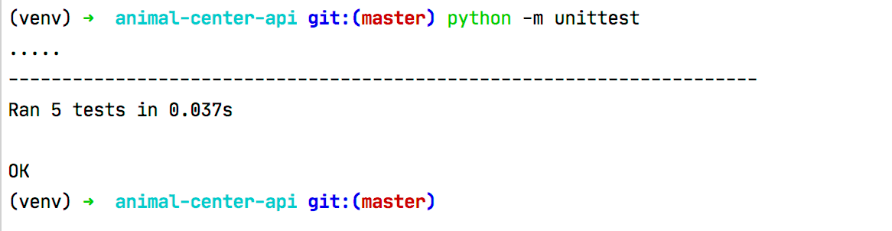

# Synopsis
Animal Center API.  

## Prerequisites
Python version 3

# Install Dependecies
1. Go to project directory.
2. Create venv by running: ```python3 -m venv venv```
3. Activate venv: ```source venv/bin/activate```
4. install dependencies by running: ```pip3 install -r requirements.txt```


# Run

run ```python app.py``` to create sqlite3 database as db.sqlite3 file and run Flask API on localhost

# Test
Tests are located in `test` folder.

To run tests use command: ```python -m unittest```

Results look like:



For more verbose results run: `python -m unittest -v`.